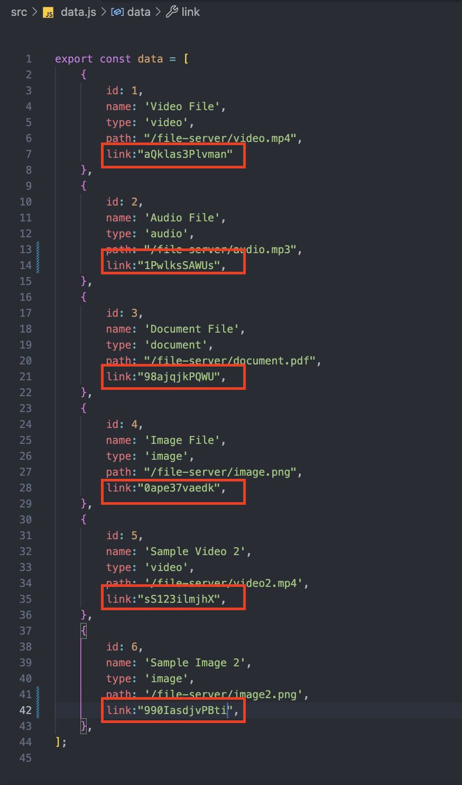
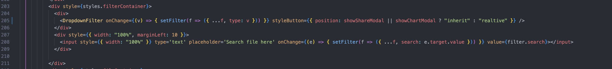
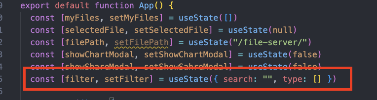
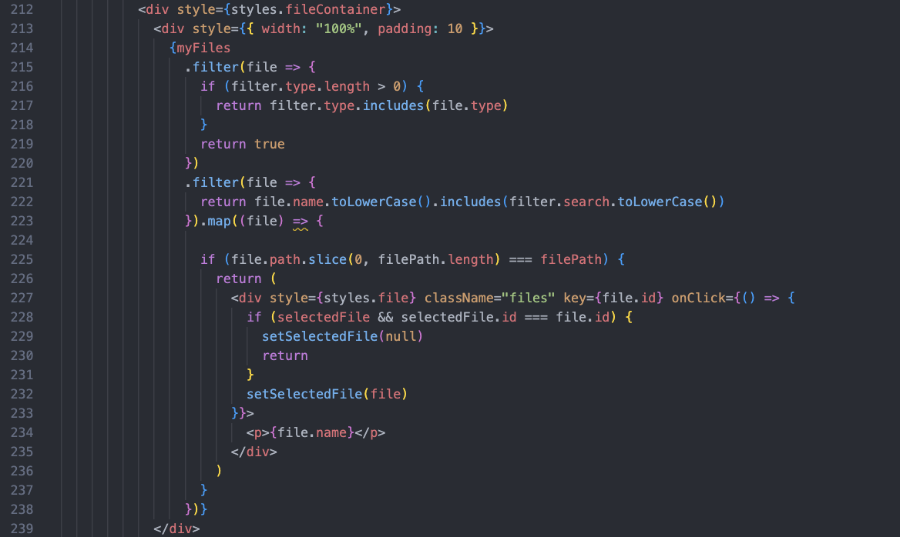
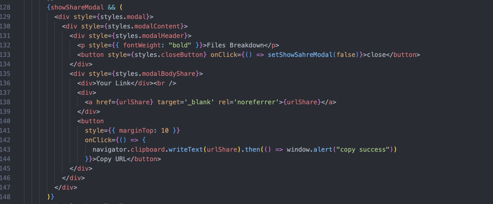
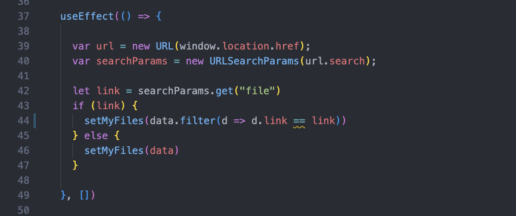

I have created two additional features, namely Search and File Filtering, and File Sharing Feature. The development of these two features is an addition to the previous material. For Search and File Filtering, I utilized reactivity state and then implemented filtering on the data array. As for the File Sharing Feature, I modified the data to have randomly generated file links.

<b>data</b>
<!-- {:width="100px"} -->

## I. Search and File Filtering:
Search and file filtering are essential features in a file management application. Here are a few reasons why these features are so important:

- Efficient Search:
In a file management application with thousands or even millions of files, search is key to quickly finding the desired files. With a robust search feature, users can easily locate files based on file names, types, modification dates, and other parameters. This saves time and effort that would otherwise be spent manually searching for files.
- Improved Organization:
  File filtering helps users organize and categorize files based on specific criteria. With this feature, users can create file categories, group files by type or attributes, and easily access relevant files. It enhances organization and facilitates seamless navigation through their file collections.
- Streamlined Workflow:
Search and file filtering not only enhance efficiency but also allow users to focus on their actual tasks. With the ability to search for files quickly and filter search results, users can easily find the files they need for their work without unnecessary distractions. This increases productivity and minimizes confusion when searching for the right files.

#### how it works
1. Add Filter and Search in app.js
   
   below is code for <b>Dropdown.js</b> component
    
2. Every input or filter change applied on App.js filter state
    
3. Filter applied here
  

## II. File Sharing Feature:
The file sharing feature is a crucial element in modern file management applications. Here are a few reasons why this feature is important:

- Efficient Team Collaboration:
In a collaborative work environment, easy and quick file sharing is essential. The file sharing feature enables users to send files to coworkers, partners, or clients without relying on separate communication methods. Team collaboration becomes smoother with the ability to share files that can be accessed and managed together.

- Scalability and Flexibility:
In an era where remote work is increasingly common, the file sharing feature is highly relevant. Users can easily share files with individuals located

#### how it works
1. File identifier is properti link in data
2. Shareable link following this format <b>https://site-url/?file={fileIdentifier}</b>
    
3. If url contain file params the data will filterred by that
    